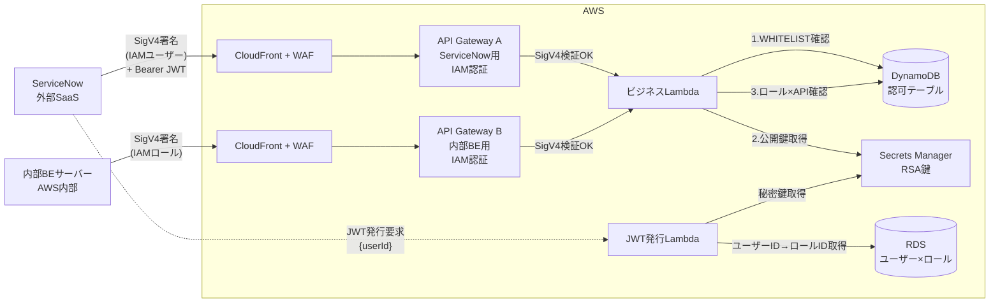
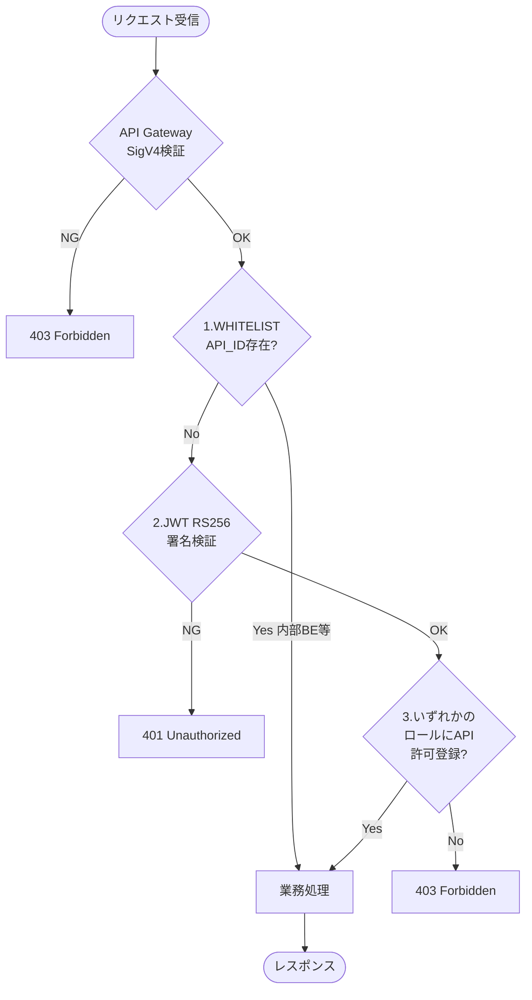

# API Gateway 認証・認可アーキテクチャ 基本設計書

| 項目 | 内容 |
|------|------|
| 作成日 | 2026-04-25 |
| 最終更新 | 2026-04-25 |
| 担当 | バルベルデ（architecture-designer） |
| ステータス | 承認済み |

---

## 1. 概要・目的

CloudFront + API Gateway + Lambda 構成で公開する API に対し、外部 SaaS（ServiceNow）と内部バックエンドサーバーの両方からの呼び出しを安全に受け付けるための認証・認可・改ざん検知のアーキテクチャを定義する。AWS 標準機能（IAM 認証・SigV4）を最大限活用し、JWT + ロールベース認可とホワイトリスト方式を組み合わせることで、追加実装を最小化しつつセキュリティ要件を満たすことを目的とする。

---

## 2. 技術スタック

### バックエンド

| 用途 | 採用技術 | 選定理由 |
|------|---------|---------|
| エッジ防御・TLS 終端 | Amazon CloudFront + AWS WAF | グローバル配信、IP 制限・レート制限・SQLi/XSS 対策などの WAF ルールをエッジで適用可能 |
| API 受付・認証 | Amazon API Gateway（IAM 認証） | SigV4 を AWS 側で自動検証でき、認証ロジックの自前実装が不要。アクセス元別にリソース分離が可能 |
| 業務処理・認可ロジック | AWS Lambda（ビジネス Lambda） | サーバーレスで運用コスト最小。呼び出し元 ARN・JWT 検証・DynamoDB 参照を 1 関数に集約可能 |
| JWT 発行 | AWS Lambda（JWT 発行 Lambda） | 同一 AWS 環境内で完結する発行基盤。秘密鍵を Secrets Manager で隔離管理可能 |
| JWT 署名方式 | RS256（非対称鍵） | 公開鍵検証側に秘密鍵を渡さずに済む。鍵ローテーション運用と相性が良い |
| ユーザー×ロール管理 | Amazon RDS | ユーザー ID に紐づくロール ID リストを管理。JWT 発行時に JWT 発行 Lambda が参照する |
| 認可データストア | Amazon DynamoDB | ロール×API 紐づけとホワイトリストを同一テーブルで管理可能。低レイテンシ・高可用 |
| シークレット管理 | AWS Secrets Manager | RSA 秘密鍵・公開鍵を安全に保管・ローテーション可能 |
| ServiceNow 認証情報 | AWS IAM ユーザー（アクセスキー） | ServiceNow Credential Store に格納し、ServiceNow 側から SigV4 署名するために必要 |
| 内部 BE 認証情報 | AWS IAM ロール | アクセスキー不要。一時クレデンシャルで安全 |

### フロントエンド

> 本設計はバックエンド／インフラのアーキテクチャ設計のため、フロントエンド技術スタックは対象外。

### 却下した選択肢

| 技術 | 却下理由 |
|------|---------|
| API Gateway カスタム Lambda Authorizer による IAM 検証の自前実装 | API Gateway 標準の IAM 認証で SigV4 検証が完結するため、自前実装は冗長 |
| API Key 認証（x-api-key） | 平文ヘッダで送信されるため漏洩リスクが高く、改ざん検知も別途必要。SigV4 の方が堅牢 |
| HMAC（共有秘密鍵）による独自署名検証 | SigV4 が同等の改ざん検知（ボディ SHA256 を署名対象に含む）を提供するため、独自実装は不要 |
| JWT HS256（共有秘密鍵） | 検証側にも秘密鍵が必要となり、漏洩時の影響範囲が大きい。RS256 の方が運用安全 |
| ServiceNow と内部 BE で同一 API Gateway を共有 | 呼び出し元別の WAF ルール・スロットリング・監査が分けにくい。リソース分離で運用がシンプル |
| ロール×API 紐づけ用に別テーブル分離 | アクセスパターンが PK/SK 設計で 1 テーブルに収まり、運用・コスト面でも統合の方が有利 |
| OAuth2 Client Credentials Flow（外部 IdP 利用） | ServiceNow と内部 BE 両方の調整コストが大きい。IAM + 自前 JWT で要件を満たせる |

---

## 3. システム構成・ディレクトリ構成

### 全体アーキテクチャ図



### 処理フロー（ビジネス Lambda 内）



### AWS リソース一覧

| リソース | 用途 |
|---------|------|
| CloudFront | エッジ防御、WAF 適用、TLS 終端 |
| AWS WAF | IP 制限、レート制限、SQLi/XSS 対策 |
| API Gateway A | ServiceNow 用エンドポイント（IAM 認証） |
| API Gateway B | 内部 BE サーバー用エンドポイント（IAM 認証） |
| Lambda（ビジネス） | 業務処理 + ホワイトリスト確認 + JWT 検証 + ロール認可 |
| Lambda（JWT 発行） | JWT トークン発行（RS256 署名） |
| IAM ユーザー | ServiceNow 用（最小権限：対象 API Gateway の `execute-api:Invoke` のみ） |
| IAM ロール | 内部 BE サーバー用（同上） |
| Secrets Manager | RSA 秘密鍵・公開鍵 |
| DynamoDB | ロール×API 紐づけ + JWT スキップ用ホワイトリスト |
| RDS | ユーザー×ロール管理（JWT 発行 Lambda が参照） |

### リポジトリ・ディレクトリ構成（想定）

```
.
├── infra/                          # IaC（CDK or Terraform）
│   ├── cloudfront/
│   ├── waf/
│   ├── apigateway/
│   │   ├── service-now/            # API Gateway A
│   │   └── internal-backend/       # API Gateway B
│   ├── lambda/
│   ├── iam/
│   ├── secrets/
│   └── dynamodb/
├── lambda/
│   ├── business/                   # ビジネスLambda（認可チェック含む）
│   │   ├── handler.ts
│   │   ├── auth/
│   │   │   ├── whitelist.ts        # WHITELIST確認
│   │   │   ├── jwt-verifier.ts     # RS256 検証
│   │   │   └── role-checker.ts     # ロール×API 確認
│   │   └── domain/                 # 業務ロジック
│   └── jwt-issuer/                 # JWT発行Lambda
│       ├── handler.ts
│       └── signer.ts
└── docs/
    └── artifacts/
        ├── 1_basic-design/
        └── 2_detailed-design/
```

---

## 4. データモデル概要

> 詳細なスキーマ・GSI・キャパシティ設定は詳細設計フェーズで定義する。

### 主要エンティティ（DynamoDB 統合テーブル）

| エンティティ | 主なフィールド | 説明 |
|------------|-------------|------|
| ロール×API 認可 | PK=`ROLE#{roleId}`, SK=`API#{method}#{routeKey}` | ロール ID と利用可能 API（routeKey）を紐づける。手動管理 |
| JWT スキップ ホワイトリスト | PK=`WHITELIST#API_ID`, SK=`#{apiId}` | JWT 認可をスキップする API Gateway の API ID 一覧（内部 BE 用 API Gateway B の API ID を登録） |

### RDS（ユーザー×ロール管理）

| テーブル | 主なカラム | 説明 |
|---------|-----------|------|
| `user_roles` | `user_id`, `role_id` | ユーザー ID に紐づくロール ID の一覧。JWT 発行時に JWT 発行 Lambda が参照し、`roles` クレームに含めて発行する |

> 詳細なスキーマ・インデックス設計は詳細設計フェーズで定義する。

### キー設計の考え方

- **1 テーブルに統合**: アクセスパターン（PK/SK 完全一致）が単純で、スキャン不要のため統合が運用しやすい。
- **routeKey 形式**: API Gateway HTTP API のイベント形式に合わせ `GET /orders/{id}` のように管理する。
- **マルチロール対応**: JWT 内の `roles` 配列を Lambda 側でループし、いずれかのロールで紐づけがあれば許可する OR 評価。

### Secrets Manager のシークレット

| シークレット名（例） | 内容 | 利用者 |
|---------------------|------|--------|
| `apigw-auth/jwt/private-key` | RSA 秘密鍵（PEM） | JWT 発行 Lambda |
| `apigw-auth/jwt/public-key` | RSA 公開鍵（PEM） | ビジネス Lambda（検証用） |

---

## 5. APIエンドポイント概要

> 詳細な処理フロー・IF 定義は詳細設計フェーズで行う。本設計書では認可基盤に関わるエンドポイントの概要のみ記載する。

ベースURL: `https://{cloudfront-domain}/`（API Gateway A / B はそれぞれ別パスまたは別ホストで分離）

| メソッド | パス | 概要 | 認証 | JWT 必須 |
|---------|------|------|------|---------|
| POST | `/auth/token` | JWT 発行（JWT 発行 Lambda）。リクエストボディにユーザー ID を受け取り、RDS からロール ID リストを取得してトークンに含めて返却 | IAM 認証（SigV4）| 不要 |
| 各種 | `/api/...`（API Gateway A） | ServiceNow 用業務 API | IAM 認証（SigV4）| 必須 |
| 各種 | `/api/...`（API Gateway B） | 内部 BE 用業務 API | IAM 認証（SigV4）| 不要（ホワイトリスト対象） |

### 認証ヘッダ

- `Authorization: AWS4-HMAC-SHA256 ...`（SigV4 署名。AWS SDK が自動付与）
- `Authorization: Bearer {JWT}` または `X-Auth-Token: {JWT}`（ServiceNow からの呼び出しで付与。詳細設計で確定）

> SigV4 と JWT を同じ `Authorization` ヘッダで競合させないため、JWT は別ヘッダ（例: `X-Auth-Token`）に載せる方針を詳細設計で確定する。

### エラーレスポンス共通形式

```json
{
  "error": {
    "code": "",
    "message": ""
  }
}
```

| HTTP ステータス | code（例） | 発生条件 |
|----------------|-----------|---------|
| 401 | `UNAUTHORIZED_SIGV4` | SigV4 検証失敗（API Gateway が返却） |
| 401 | `UNAUTHORIZED_JWT` | JWT 署名不正・期限切れ |
| 403 | `FORBIDDEN_ROLE` | ロールに該当 API の許可なし |
| 403 | `FORBIDDEN_CALLER` | 呼び出し元 ARN が想定外 |

---

## 6. フロントエンドコンポーネント構成

> 本設計はバックエンド／インフラのアーキテクチャ設計のため、対象外。

---

## 7. 環境変数

### バックエンド（ビジネス Lambda）

| 変数名 | 説明 | 例 |
|--------|------|-----|
| `AUTH_TABLE_NAME` | 認可情報を格納する DynamoDB テーブル名 | `apigw-auth-table` |
| `JWT_PUBLIC_KEY_SECRET_ID` | RSA 公開鍵の Secrets Manager シークレット ID | `apigw-auth/jwt/public-key` |
| `JWT_ISSUER` | 期待する JWT の `iss` クレーム | `https://auth.example.internal` |
| `JWT_AUDIENCE` | 期待する JWT の `aud` クレーム | `apigw-business` |
| `EXPECTED_SERVICENOW_USER_ARN` | ServiceNow 用 IAM ユーザー ARN（呼び出し元判別用） | `arn:aws:iam::<ACCOUNT_ID>:user/servicenow-user` |
| `EXPECTED_BACKEND_ROLE_ARN_PREFIX` | 内部 BE 用 IAM ロール ARN プレフィックス（assumed-role 形式） | `arn:aws:iam::<ACCOUNT_ID>:assumed-role/backend-role/` |
| `LOG_LEVEL` | ログレベル | `INFO` |

### バックエンド（JWT 発行 Lambda）

| 変数名 | 説明 | 例 |
|--------|------|-----|
| `JWT_PRIVATE_KEY_SECRET_ID` | RSA 秘密鍵の Secrets Manager シークレット ID | `apigw-auth/jwt/private-key` |
| `JWT_ISSUER` | JWT の `iss` クレーム | `https://auth.example.internal` |
| `JWT_AUDIENCE` | JWT の `aud` クレーム | `apigw-business` |
| `JWT_TTL_SECONDS` | トークン有効期限（秒） | `3600` |
| `RDS_HOST` | RDS エンドポイント | `auth-db.cluster-xxxx.ap-northeast-1.rds.amazonaws.com` |
| `RDS_PORT` | RDS ポート | `5432` |
| `RDS_DATABASE` | データベース名 | `authdb` |
| `RDS_SECRET_ID` | RDS 接続情報（ユーザー名・パスワード）の Secrets Manager シークレット ID | `apigw-auth/rds/credentials` |

### フロントエンド

> 対象外。

### ハードコード禁止方針

- API ID、AWS アカウント ID、ARN、シークレット名、エンドポイントは**すべて環境変数または Secrets Manager 経由**で取得する。
- ソースコード内へのアカウント ID・URL・キー直書きは禁止。
- ドキュメントには `<ACCOUNT_ID>` 等のプレースホルダを用いる。

---

## 8. 実装フェーズ計画

| フェーズ | 内容 | 担当 | 備考 |
|---------|------|------|------|
| ① 詳細設計 | API 一覧・ロール体系・DynamoDB スキーマ・JWT クレーム・エラーコード詳細を確定 | バルベルデ | `docs/artifacts/2_detailed-design/backend/` 配下 |
| ② インフラ基盤構築 | CloudFront / WAF / API Gateway A・B / IAM ユーザー・ロール / DynamoDB / Secrets Manager を IaC で構築 | ベリンガム | 環境変数・シークレット名の規約をここで固定 |
| ③ JWT 発行 Lambda 実装 | RS256 署名・Secrets Manager 連携・有効期限管理 | ヴィニシウス | 単体テストで署名・検証ラウンドトリップを担保 |
| ④ ビジネス Lambda 実装 | ホワイトリスト確認 → JWT 検証 → ロール×API 確認の 3 段認可処理 | ヴィニシウス | 認可レイヤと業務ロジックを分離して実装 |
| ⑤ ServiceNow 連携設定 | Credential Store にアクセスキー登録、SigV4 署名設定、JWT 取得・付与フロー組み込み | ベリンガム | ServiceNow 側担当者と連携 |
| ⑥ セキュリティレビュー | IAM 最小権限、WAF ルール、シークレット管理、ハードコード検査、JWT クレーム検証の網羅性 | クルトワ | OWASP API Security Top 10 を観点に含める |
| ⑦ 結合テスト | 正常系（ServiceNow / 内部 BE 両経路）、異常系（SigV4 不正、JWT 改ざん、ロール権限なし、ボディ改ざん） | ギュレル | 改ざん検知の検証は SigV4 と JWT の両面で実施 |

---

## 9. リスクと対策

| リスク | 影響度 | 対策 |
|-------|-------|------|
| ServiceNow に格納する IAM ユーザーのアクセスキー漏洩 | 高 | 最小権限ポリシー（対象 API Gateway の `execute-api:Invoke` のみ）。定期ローテーション。CloudTrail で利用元 IP・呼び出しを監視。Credential Store の暗号化 |
| RSA 秘密鍵の漏洩 | 高 | Secrets Manager で管理し、JWT 発行 Lambda の実行ロールのみ `secretsmanager:GetSecretValue` を許可。アクセスログを CloudTrail で監査。ローテーション計画を策定 |
| ホワイトリスト誤登録による外部からの JWT バイパス | 高 | ホワイトリスト追加は IaC 経由のみとし、手動コンソール操作を IAM で禁止。PR レビュー必須。CloudTrail でテーブル変更を監視 |
| API Gateway A（ServiceNow 用）の API ID がホワイトリストに混入 | 高 | API ID をハードコード参照ではなく IaC の output で管理し、レビューでクロスチェック。本番では API ID リストの監査クエリを定期実行 |
| JWT の有効期限切れ・時刻ずれ | 中 | クライアント側でトークンキャッシュ + 期限前再発行を実装。Lambda 側で `exp`/`nbf`/`iat` を検証し、許容クロックスキューを定義 |
| ロール×API テーブルの設定漏れによる正常リクエスト拒否 | 中 | エントリ追加を IaC 化し PR レビュー。CloudWatch で 403 レート急増を検知 |
| SigV4 署名失敗による誤遮断 | 中 | クライアント時刻同期（NTP）を周知。ServiceNow 側の SDK バージョンを固定。署名失敗ログを WAF/API Gateway 側で集約 |
| DynamoDB スロットリング | 中 | オンデマンドキャパシティで開始。アクセスパターンが固定化したらプロビジョンドへ移行検討。Lambda 内で短時間キャッシュ（in-memory）で読み取り削減 |
| 呼び出し元 ARN の誤判定（assumed-role セッション名の差異など） | 中 | プレフィックス一致（`arn:aws:iam::ACCOUNT:assumed-role/backend-role/`）で判定。許容パターンをテストで網羅 |
| WAF ルールの過剰ブロックによる正常通信遮断 | 中 | カウントモードで一定期間運用してから Block へ切り替え。ServiceNow / 内部 BE のヘッダ・ボディパターンを事前に取得 |
| 鍵ローテーション時の検証失敗 | 中 | 旧鍵・新鍵を一定期間並行で受け付ける（kid ヘッダで切替）。Secrets Manager のステージング機能を利用 |

---
