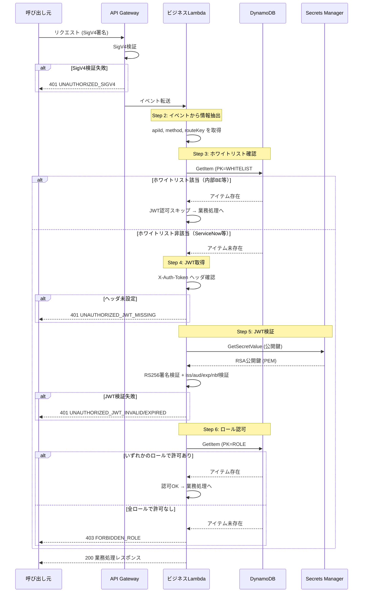
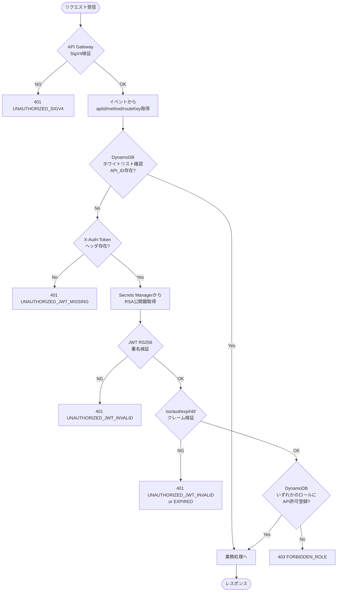

# 認可処理フロー（共通ミドルウェア）処理設計書

| 項目 | 内容 |
|------|------|
| 作成日 | 2026-04-27 |
| 最終更新 | 2026-04-27 |
| メソッド | 全メソッド（共通処理） |
| パス | 全業務 API（共通処理） |
| 認証 | 要（IAM 認証 / SigV4 + JWT / ホワイトリスト） |
| ステータス | レビュー中 |

---

## 1. 概要

ビジネス Lambda 内で全業務 API に共通して適用される認可処理フローを定義する。本設計は API エンドポイントではなく、ビジネス Lambda のハンドラーが業務ロジック実行前に呼び出す**共通認可ミドルウェア**の処理設計である。

認可は以下の 3 段階で実施する:

1. **ホワイトリスト確認** — API Gateway の API ID が DynamoDB のホワイトリストに登録されていれば JWT 認可をスキップ
2. **JWT 署名検証** — `X-Auth-Token` ヘッダの JWT を RS256 公開鍵で検証
3. **ロール認可** — JWT 内のロール情報と DynamoDB のロール × API 紐づけを照合

---

## 2. リクエスト仕様

### ヘッダー

| ヘッダー | 値 | 必須 |
|---------|-----|------|
| Authorization | AWS4-HMAC-SHA256 ...（SigV4 署名） | ○（API Gateway が検証済み） |
| X-Auth-Token | {JWT} | ServiceNow 経由の場合: ○ / 内部 BE 経由の場合: ×（ホワイトリストでスキップ） |

### パスパラメータ

業務 API ごとに異なる（本設計では認可処理の共通フローを定義）。

### クエリパラメータ

業務 API ごとに異なる（本設計では認可処理の共通フローを定義）。

### リクエストボディ

業務 API ごとに異なる（本設計では認可処理の共通フローを定義）。

---

## 3. バリデーション

| # | フィールド | ルール | エラーコード | エラーメッセージ |
|---|----------|--------|------------|--------------|
| 1 | `X-Auth-Token` | JWT 必須 API の場合、ヘッダーが存在すること | `UNAUTHORIZED_JWT_MISSING` | Authentication token is required |
| 2 | `X-Auth-Token` | JWT 文字列が有効な JWT 形式（3 パート、Base64URL エンコード）であること | `UNAUTHORIZED_JWT_INVALID` | Invalid authentication token |
| 3 | JWT 署名 | RS256 公開鍵で署名検証が成功すること | `UNAUTHORIZED_JWT_INVALID` | Invalid authentication token |
| 4 | JWT `iss` | 環境変数 `JWT_ISSUER` と一致すること | `UNAUTHORIZED_JWT_INVALID` | Invalid authentication token |
| 5 | JWT `aud` | 環境変数 `JWT_AUDIENCE` と一致すること | `UNAUTHORIZED_JWT_INVALID` | Invalid authentication token |
| 6 | JWT `exp` | 現在時刻 < exp であること（許容クロックスキュー: 30 秒） | `UNAUTHORIZED_JWT_EXPIRED` | Authentication token has expired |
| 7 | JWT `nbf` | 存在する場合、現在時刻 >= nbf であること（許容クロックスキュー: 30 秒） | `UNAUTHORIZED_JWT_INVALID` | Invalid authentication token |
| 8 | JWT `roles` | 配列が空でないこと | `FORBIDDEN_ROLE` | Access denied: insufficient permissions |

---

## 4. 処理フロー

```
1. API Gateway が SigV4 署名を検証（Lambda 到達時点で検証済み）
2. Lambda イベントから情報を抽出
   2.1. requestContext.apiId → API ID を取得
   2.2. requestContext.http.method → HTTP メソッドを取得
   2.3. routeKey → ルートキーを取得（例: "GET /api/orders/{id}"）
3. DynamoDB ホワイトリスト確認
   3.1. PK="WHITELIST#API_ID", SK="#{apiId}" で GetItem
   3.2. アイテムが存在する → ホワイトリスト対象 → 手順7（業務処理）へスキップ
   3.3. アイテムが存在しない → 手順4（JWT 検証）へ
4. X-Auth-Token ヘッダから JWT を取得
   4.1. ヘッダ未設定 → 401 UNAUTHORIZED_JWT_MISSING
   4.2. JWT を取得
5. JWT 検証
   5.1. Secrets Manager から RSA 公開鍵を取得（シークレット ID: 環境変数 JWT_PUBLIC_KEY_SECRET_ID）
   5.2. RS256 署名検証
   5.3. iss クレーム検証（環境変数 JWT_ISSUER と一致）
   5.4. aud クレーム検証（環境変数 JWT_AUDIENCE と一致）
   5.5. exp クレーム検証（現在時刻 < exp + 30秒）
   5.6. nbf クレーム検証（存在する場合: 現在時刻 >= nbf - 30秒）
   5.7. いずれかの検証失敗 → 401 UNAUTHORIZED_JWT_INVALID または UNAUTHORIZED_JWT_EXPIRED
6. ロール認可
   6.1. JWT の roles クレームからロール ID リストを取得
   6.2. 各ロール ID について DynamoDB を参照:
        PK="ROLE#{roleId}", SK="API#{method}#{routeKey}" で GetItem
   6.3. いずれかのロールで許可エントリが存在する → 手順7（業務処理）へ（OR 評価）
   6.4. すべてのロールで許可エントリが存在しない → 403 FORBIDDEN_ROLE
7. 業務処理へ制御を移行
```

### シーケンス図



### 処理フロー図



---

## 5. レスポンス仕様

### 成功レスポンス

認可成功時は業務処理に制御を移行するため、本ミドルウェアからの直接レスポンスはない。

### エラーレスポンス

| ステータス | エラーコード | 条件 | メッセージ |
|----------|------------|------|----------|
| 401 | `UNAUTHORIZED_SIGV4` | SigV4 検証失敗（API Gateway が返却） | Signature verification failed |
| 401 | `UNAUTHORIZED_JWT_MISSING` | `X-Auth-Token` ヘッダが未設定（JWT 必須 API） | Authentication token is required |
| 401 | `UNAUTHORIZED_JWT_INVALID` | JWT 署名不正、iss/aud/nbf 検証失敗 | Invalid authentication token |
| 401 | `UNAUTHORIZED_JWT_EXPIRED` | JWT 有効期限切れ | Authentication token has expired |
| 403 | `FORBIDDEN_ROLE` | 全ロールで該当 API の許可なし | Access denied: insufficient permissions |

---

## 6. トランザクション

該当なし。DynamoDB への読み取りのみであり、トランザクション制御は不要。

---

## 7. セキュリティ考慮事項

- [x] 認証チェック実装（SigV4 は API Gateway が自動検証）
- [ ] JWT 検証の網羅性（署名、iss、aud、exp、nbf のすべてを検証）
- [ ] JWT の `alg` ヘッダを `RS256` に固定し、`none` アルゴリズム攻撃を防止
- [ ] 公開鍵は Secrets Manager 経由でのみ取得（ソースコード・環境変数にハードコードしない）
- [ ] 公開鍵のインメモリキャッシュを適用し、Secrets Manager への過剰な API コールを抑制（TTL: 5 分程度）
- [ ] JWT の検証エラー時に詳細な内部情報（鍵情報、スタックトレース等）をレスポンスに含めない
- [ ] DynamoDB のホワイトリストエントリは IaC 経由でのみ管理し、手動変更を禁止
- [ ] ロール認可の結果（許可/拒否）を CloudWatch Logs に記録（JWT のペイロード全体はログ出力しない）
- [ ] 許容クロックスキュー（30 秒）は過大にしない（タイムウィンドウ攻撃の軽減）

---

## 8. 未解決事項

| # | 内容 | 担当 | 期限 |
|---|------|------|------|
| 1 | 公開鍵のインメモリキャッシュ TTL の最適値 | ヴィニシウス | 実装時 |
| 2 | DynamoDB ロール認可の BatchGetItem 最適化（ロール数が多い場合） | ヴィニシウス | 実装時 |
| 3 | `kid`（Key ID）による鍵ローテーション対応の将来設計 | バルベルデ | 将来対応 |
