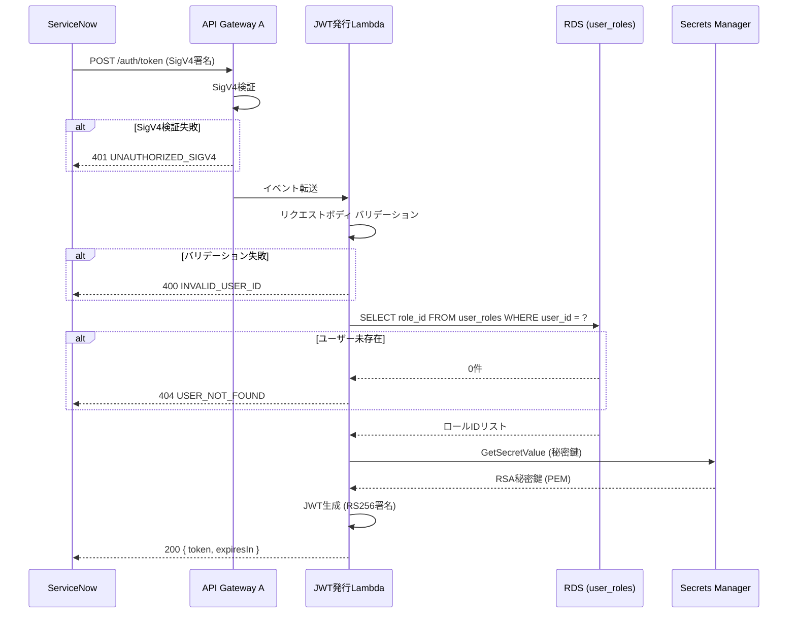

# JWT トークン発行 API 処理設計書

| 項目 | 内容 |
|------|------|
| 作成日 | 2026-04-27 |
| 最終更新 | 2026-04-27 |
| メソッド | POST |
| パス | `/auth/token` |
| 認証 | 要（IAM 認証 / SigV4） |
| ステータス | レビュー中 |

---

## 1. 概要

ユーザー ID を受け取り、RDS の `user_roles` テーブルからロール ID リストを取得し、RS256 署名付き JWT を発行して返却する。ServiceNow がこのトークンを取得し、業務 API 呼び出し時に `X-Auth-Token` ヘッダに付与する。

---

## 2. リクエスト仕様

### ヘッダー

| ヘッダー | 値 | 必須 |
|---------|-----|------|
| Content-Type | application/json | ○ |
| Authorization | AWS4-HMAC-SHA256 ...（SigV4 署名） | ○ |

### パスパラメータ

なし。

### クエリパラメータ

なし。

### リクエストボディ

```json
{
  "userId": "string  // 必須: トークン発行対象のユーザーID"
}
```

---

## 3. バリデーション

| # | フィールド | ルール | エラーコード | エラーメッセージ |
|---|----------|--------|------------|--------------|
| 1 | リクエストボディ | JSON として解析可能であること | `INVALID_REQUEST_BODY` | Invalid request body |
| 2 | `userId` | 必須。空文字・null 不可 | `INVALID_USER_ID` | Invalid or missing userId |
| 3 | `userId` | 文字列型であること | `INVALID_USER_ID` | Invalid or missing userId |
| 4 | `userId` | 最大 256 文字 | `INVALID_USER_ID` | Invalid or missing userId |
| 5 | `userId` | RDS `user_roles` テーブルに存在すること | `USER_NOT_FOUND` | User not found |

---

## 4. 処理フロー

```
1. API Gateway が SigV4 署名を検証（Lambda 到達時点で検証済み）
2. リクエストボディのバリデーション
   2.1. JSON パース
   2.2. userId の存在・形式チェック
3. RDS からロール ID リスト取得
   3.1. user_roles テーブルを userId で検索
   3.2. 該当ユーザーが存在しない場合 → 404 エラー
   3.3. ロール ID リストを取得
4. Secrets Manager から RSA 秘密鍵を取得
   4.1. シークレット ID: 環境変数 JWT_PRIVATE_KEY_SECRET_ID
5. JWT 生成（RS256 署名）
   5.1. ヘッダー: { alg: "RS256", typ: "JWT" }
   5.2. ペイロード:
        - iss: 環境変数 JWT_ISSUER
        - aud: 環境変数 JWT_AUDIENCE
        - sub: userId
        - roles: [roleId, ...] （ロール ID のリスト）
        - iat: 現在時刻（UNIX タイムスタンプ）
        - exp: 現在時刻 + 環境変数 JWT_TTL_SECONDS
   5.3. RS256 秘密鍵で署名
6. レスポンス返却
```

### シーケンス図



---

## 5. レスポンス仕様

### 成功レスポンス

**ステータスコード:** 200

```json
{
  "success": true,
  "data": {
    "token": "eyJhbGciOiJSUzI1NiIsInR5cCI6IkpXVCJ9...",
    "expiresIn": 3600
  }
}
```

| フィールド | 型 | 説明 |
|----------|-----|------|
| `token` | string | RS256 署名付き JWT トークン |
| `expiresIn` | number | トークン有効期間（秒）。環境変数 `JWT_TTL_SECONDS` の値 |

### JWT ペイロード構造

| クレーム | 型 | 説明 | 例 |
|---------|-----|------|-----|
| `iss` | string | トークン発行者 | `https://auth.example.internal` |
| `aud` | string | トークン受信者 | `apigw-business` |
| `sub` | string | ユーザー ID | `user-12345` |
| `roles` | string[] | ロール ID のリスト | `["role-admin", "role-viewer"]` |
| `iat` | number | 発行日時（UNIX タイムスタンプ） | `1745712000` |
| `exp` | number | 有効期限（UNIX タイムスタンプ） | `1745715600` |

### エラーレスポンス

| ステータス | エラーコード | 条件 | メッセージ |
|----------|------------|------|----------|
| 400 | `INVALID_REQUEST_BODY` | JSON パース失敗 | Invalid request body |
| 400 | `INVALID_USER_ID` | userId が空・null・不正形式 | Invalid or missing userId |
| 401 | `UNAUTHORIZED_SIGV4` | SigV4 検証失敗（API Gateway が返却） | Signature verification failed |
| 404 | `USER_NOT_FOUND` | 指定された userId が RDS に存在しない | User not found |
| 500 | `INTERNAL_ERROR` | Secrets Manager 接続失敗、RDS 接続失敗等 | Internal server error |

---

## 6. トランザクション

| # | 処理範囲 | 分離レベル | 理由 |
|---|---------|----------|------|
| 1 | RDS `user_roles` テーブルの読み取り | READ COMMITTED | 読み取りのみのため厳密な分離は不要。ロール情報の一貫性は十分に確保される |

---

## 7. セキュリティ考慮事項

- [x] 認証チェック実装（SigV4 は API Gateway が自動検証）
- [ ] 入力値サニタイズ（userId のバリデーション・長さ制限）
- [ ] レートリミット適用（WAF で POST `/auth/token` に対するレートリミットを設定）
- [ ] センシティブ情報のログ出力禁止（JWT トークン、秘密鍵をログに出力しない）
- [ ] RSA 秘密鍵は Secrets Manager 経由でのみ取得（ソースコード・環境変数にハードコードしない）
- [ ] RDS 接続情報は Secrets Manager 経由で取得（環境変数 `RDS_SECRET_ID`）
- [ ] userId に対する SQL インジェクション対策（パラメータ化クエリの使用必須）

---

## 8. 未解決事項

| # | 内容 | 担当 | 期限 |
|---|------|------|------|
| 1 | userId の命名規約・形式（UUID、メールアドレス等）の確定 | シャビ | 詳細設計完了前 |
| 2 | JWT の `kid`（Key ID）ヘッダの将来対応（鍵ローテーション時） | バルベルデ | 将来対応 |
