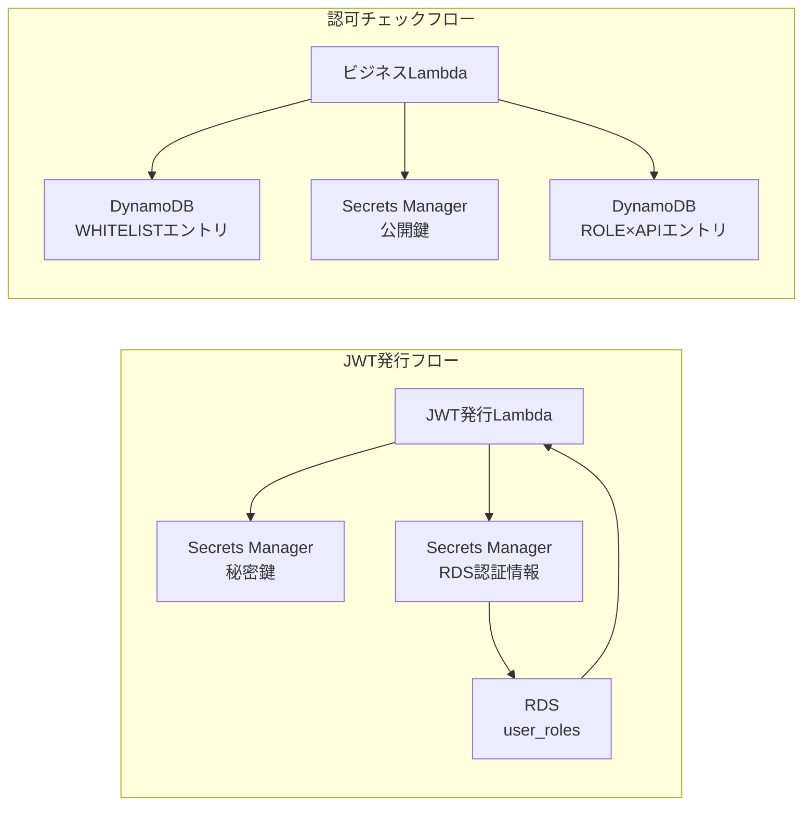

# データエンティティ関連図

| 項目 | 内容 |
|------|------|
| 作成日 | 2026-04-27 |
| 最終更新 | 2026-04-27 |
| ステータス | レビュー中 |

---

## 1. 概要

API Gateway 認証・認可基盤で使用するデータエンティティの全体像を定義する。
本システムは DynamoDB（認可テーブル）、RDS PostgreSQL（ユーザー×ロール管理）、Secrets Manager（鍵・認証情報管理）の 3 つのデータストアで構成される。

DynamoDB はシングルテーブルデザインを採用しており、リレーショナル DB の ER 図とは異なるアイテムコレクション方式で表現する。

---

## 2. ER 図

> DynamoDB のエンティティはアイテムコレクション（論理エンティティ）として表現する。
> Secrets Manager のシークレットはデータエンティティとして含める。

```mermaid
erDiagram
    AUTH_TABLE_ROLE_API {
        string PK "ROLE#{roleId}"
        string SK "API#{method}#{routeKey}"
        string effect "ALLOW"
        string description "説明"
        string created_at "ISO8601"
        string updated_at "ISO8601"
    }

    AUTH_TABLE_WHITELIST {
        string PK "WHITELIST#API_ID"
        string SK "#{apiId}"
        string description "説明"
        string created_at "ISO8601"
        string updated_at "ISO8601"
    }

    USER_ROLES {
        uuid id "PK"
        string user_id "NOT NULL"
        string role_id "NOT NULL"
        timestamp created_at "NOT NULL"
        timestamp updated_at "NOT NULL"
    }

    SECRETS_JWT_PRIVATE_KEY {
        string secret_name "apigw-auth/jwt/private-key"
        string secret_value "RSA秘密鍵 PEM"
    }

    SECRETS_JWT_PUBLIC_KEY {
        string secret_name "apigw-auth/jwt/public-key"
        string secret_value "RSA公開鍵 PEM"
    }

    SECRETS_RDS_CREDENTIALS {
        string secret_name "apigw-auth/rds/credentials"
        string username "DB接続ユーザー"
        string password "DB接続パスワード"
    }

    USER_ROLES ||--|| SECRETS_RDS_CREDENTIALS : "JWT発行Lambdaが接続情報を取得"
    AUTH_TABLE_ROLE_API ||--|| SECRETS_JWT_PUBLIC_KEY : "ビジネスLambdaがJWT検証に公開鍵を使用"
    SECRETS_JWT_PRIVATE_KEY ||--|| USER_ROLES : "JWT発行Lambdaがロール取得後にJWT署名"
```

### データフロー補足



---

## 3. エンティティ一覧

| # | エンティティ名 | テーブル/ストア名 | 概要 | 備考 |
|---|--------------|----------------|------|------|
| 1 | ロール×API 認可 | DynamoDB 認可テーブル（`ROLE#` プレフィックス） | ロール ID と利用可能 API の紐づけ | シングルテーブルデザイン |
| 2 | JWT スキップ ホワイトリスト | DynamoDB 認可テーブル（`WHITELIST#` プレフィックス） | JWT 認可をスキップする API Gateway の API ID 一覧 | シングルテーブルデザイン |
| 3 | ユーザー×ロール | RDS PostgreSQL `user_roles` テーブル | ユーザー ID に紐づくロール ID の一覧 | JWT 発行時に参照 |
| 4 | JWT 秘密鍵 | Secrets Manager `apigw-auth/jwt/private-key` | RSA 秘密鍵（PEM） | JWT 発行 Lambda が使用 |
| 5 | JWT 公開鍵 | Secrets Manager `apigw-auth/jwt/public-key` | RSA 公開鍵（PEM） | ビジネス Lambda が検証に使用 |
| 6 | RDS 接続情報 | Secrets Manager `apigw-auth/rds/credentials` | DB 接続ユーザー名・パスワード | JWT 発行 Lambda が RDS 接続時に使用 |

---

## 4. リレーション一覧

> DynamoDB はリレーショナル DB ではないため、物理的な外部キー制約は存在しない。
> 以下はアプリケーションレベルでの論理的な関連を示す。

| # | 親エンティティ | 子エンティティ | カーディナリティ | 外部キー | CASCADE | 備考 |
|---|-------------|-------------|---------------|---------|---------|------|
| 1 | （ロールマスタ）※外部管理 | ロール×API 認可 | 1:N | roleId（論理） | なし | DynamoDB 側は PK に roleId を含む。ロールマスタは本システムのスコープ外 |
| 2 | （ユーザーマスタ）※外部管理 | ユーザー×ロール | 1:N | user_id（論理） | なし | ユーザーマスタは本システムのスコープ外 |
| 3 | （ロールマスタ）※外部管理 | ユーザー×ロール | 1:N | role_id（論理） | なし | ロールマスタは本システムのスコープ外 |

---

## 5. 多対多の中間テーブル

| 中間テーブル名 | エンティティ A | エンティティ B | 追加属性 |
|-------------|-------------|-------------|---------|
| user_roles | ユーザー（外部管理） | ロール（外部管理） | created_at, updated_at |

> `user_roles` はユーザーとロールの多対多を解決する中間テーブルとして機能する。ただし、ユーザーマスタ・ロールマスタ自体は本システムのスコープ外である。

---

## 6. インデックス方針

| テーブル名 | インデックス対象 | 種別 | 理由 |
|----------|---------------|------|------|
| DynamoDB 認可テーブル | PK + SK | PRIMARY（パーティションキー + ソートキー） | 全アクセスパターンが PK/SK 完全一致の GetItem で完結するため |
| DynamoDB 認可テーブル | GSI: `GSI_SK_PK`（SK → PK） | GSI | 逆引き（API に許可されたロール一覧取得）の運用・監査用途 |
| user_roles | id | PRIMARY | 主キー |
| user_roles | (user_id, role_id) | UNIQUE | 同一ユーザー×同一ロールの重複防止 |
| user_roles | user_id | INDEX | JWT 発行時に user_id で検索するため |

---

## 7. 未解決事項

| # | 内容 | 担当 | 期限 |
|---|------|------|------|
| 1 | ロールマスタ・ユーザーマスタの管理方法（既存システムとの連携 or 新規構築） | シャビ | 詳細設計中 |
| 2 | DynamoDB GSI の必要性確定（運用・監査で逆引きが必要か） | バルベルデ | 実装前 |
| 3 | RDS 接続情報の Secrets Manager 自動ローテーション設定の有無 | ベリンガム | インフラ構築時 |
