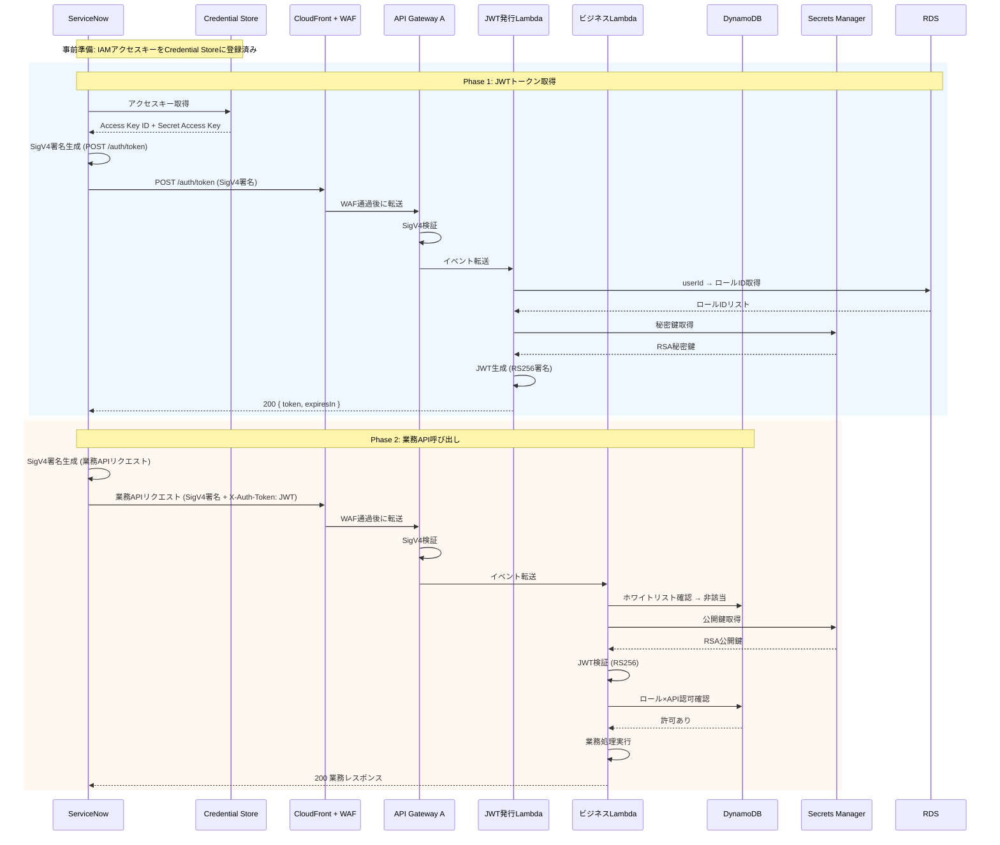

# ServiceNow 外部連携 IF 定義

| 項目 | 内容 |
|------|------|
| 作成日 | 2026-04-27 |
| 最終更新 | 2026-04-27 |
| 連携先 | ServiceNow（外部 SaaS） |
| 通信方式 | REST API（HTTPS） |
| ステータス | レビュー中 |

---

## 1. 概要

ServiceNow から AWS API Gateway A を経由してビジネス Lambda を呼び出すための外部連携インターフェースを定義する。

ServiceNow は以下の 2 段階で API を呼び出す:

1. **JWT 取得**: POST `/auth/token` に SigV4 署名付きリクエストを送信し、JWT トークンを取得する
2. **業務 API 呼び出し**: 取得した JWT を `X-Auth-Token` ヘッダに付与し、SigV4 署名付きで業務 API を呼び出す

認証は **IAM 認証（SigV4）+ JWT** の 2 層構成であり、SigV4 は改ざん検知・送信者認証、JWT はロールベースの認可を担う。

---

## 2. 接続情報

| 項目 | 値 |
|------|-----|
| ベース URL | `https://{cloudfront-domain-a}/`（API Gateway A 用 CloudFront ドメイン。環境変数で管理） |
| 認証方式 | IAM 認証（SigV4）+ JWT（`X-Auth-Token` ヘッダ） |
| SigV4 認証情報 | IAM ユーザーのアクセスキー ID + シークレットアクセスキー（ServiceNow Credential Store で管理） |
| JWT 認証情報 | POST `/auth/token` で取得した JWT トークン |
| 署名リージョン | `ap-northeast-1` |
| 署名サービス | `execute-api` |
| タイムアウト | 30 秒（ServiceNow の REST Message 設定） |
| リトライ方針 | 401/403 はリトライ不要。5xx は最大 3 回、指数バックオフ（1s, 2s, 4s） |

> **注意**: 実際の CloudFront ドメイン、アクセスキー ID、シークレットアクセスキーはドキュメントに記載しない。ServiceNow Credential Store および AWS 環境変数で管理する。

---

## 3. 使用する API 一覧

| # | メソッド | パス | 用途 | 使用箇所 |
|---|---------|------|------|---------|
| 1 | POST | `/auth/token` | JWT トークン発行 | ServiceNow ワークフロー開始時（トークン取得） |
| 2 | 各種 | `/api/...` | 業務 API 呼び出し | ServiceNow ワークフロー内の各ステップ |

---

## 4. IF 定義（API ごと）

### 4.1 JWT トークン発行

**リクエスト:**

| 項目 | 内容 |
|------|------|
| メソッド | POST |
| パス | `/auth/token` |
| Content-Type | application/json |

ヘッダー:

| ヘッダー | 値 | 備考 |
|---------|-----|------|
| Authorization | AWS4-HMAC-SHA256 ...（SigV4 署名） | ServiceNow が IAM ユーザーのアクセスキーで署名を生成 |
| Content-Type | application/json | - |

リクエストボディ:

```json
{
  "userId": "servicenow-integration-user"
}
```

**レスポンス（成功）:**

HTTP 200

```json
{
  "success": true,
  "data": {
    "token": "eyJhbGciOiJSUzI1NiIsInR5cCI6IkpXVCJ9...",
    "expiresIn": 3600
  }
}
```

**レスポンス（エラー）:**

```json
{
  "error": {
    "code": "UNAUTHORIZED_SIGV4",
    "message": "Signature verification failed"
  }
}
```

**エラーハンドリング:**

| 外部のステータス | 外部のエラー内容 | 自システム（ServiceNow）の対応 | 自システムのエラーコード |
|---------------|---------------|-------------------------------|-------------------|
| 401 | `UNAUTHORIZED_SIGV4` | アクセスキーの有効性を確認。ローテーション実施の可能性あり | SN_AUTH_SIGV4_FAILED |
| 400 | `INVALID_USER_ID` | userId の設定値を確認 | SN_INVALID_CONFIG |
| 404 | `USER_NOT_FOUND` | AWS 側のユーザー登録状況を確認 | SN_USER_NOT_REGISTERED |
| 500 | `INTERNAL_ERROR` | 指数バックオフでリトライ（最大 3 回）。失敗ならエスカレーション | SN_AWS_INTERNAL_ERROR |

### 4.2 業務 API 呼び出し（共通パターン）

**リクエスト:**

| 項目 | 内容 |
|------|------|
| メソッド | 業務 API ごとに異なる（GET / POST / PUT / DELETE） |
| パス | `/api/...`（業務 API ごとに異なる） |
| Content-Type | application/json |

ヘッダー:

| ヘッダー | 値 | 備考 |
|---------|-----|------|
| Authorization | AWS4-HMAC-SHA256 ...（SigV4 署名） | ServiceNow が IAM ユーザーのアクセスキーで署名を生成 |
| X-Auth-Token | {JWT} | 4.1 で取得した JWT トークン |
| Content-Type | application/json | - |

リクエストボディ:

```json
{
  "...業務APIごとに異なる..."
}
```

**レスポンス（成功）:**

HTTP 200/201/204（業務 API ごとに異なる）

```json
{
  "success": true,
  "data": { "...業務APIごとに異なる..." }
}
```

**レスポンス（エラー）:**

```json
{
  "error": {
    "code": "ERROR_CODE",
    "message": "エラーメッセージ"
  }
}
```

**エラーハンドリング:**

| 外部のステータス | 外部のエラー内容 | 自システム（ServiceNow）の対応 | 自システムのエラーコード |
|---------------|---------------|-------------------------------|-------------------|
| 401 | `UNAUTHORIZED_SIGV4` | アクセスキーの有効性を確認 | SN_AUTH_SIGV4_FAILED |
| 401 | `UNAUTHORIZED_JWT_MISSING` | JWT トークンの付与漏れ。X-Auth-Token ヘッダを確認 | SN_JWT_MISSING |
| 401 | `UNAUTHORIZED_JWT_INVALID` | JWT トークンの再取得を試行 | SN_JWT_INVALID |
| 401 | `UNAUTHORIZED_JWT_EXPIRED` | JWT トークンを再取得（POST `/auth/token`）してリトライ | SN_JWT_EXPIRED |
| 403 | `FORBIDDEN_ROLE` | ロール設定を確認。AWS 側管理者にエスカレーション | SN_INSUFFICIENT_PERMISSIONS |
| 429 | - | 指数バックオフでリトライ | SN_RATE_LIMITED |
| 500 | `INTERNAL_ERROR` | 指数バックオフでリトライ（最大 3 回）。失敗ならエスカレーション | SN_AWS_INTERNAL_ERROR |

---

## 5. データマッピング

> ServiceNow と AWS 間の主要なデータマッピングを定義する。業務 API ごとの詳細なマッピングは各業務 API の設計書で定義する。

### 認証・認可関連

| ServiceNow 側 | 型 | AWS 側 | 型 | 変換ロジック |
|-------------|-----|-----------------|-----|-----------|
| Credential Store: AWS Access Key ID | string | IAM ユーザーのアクセスキー ID | string | SigV4 署名生成に使用。変換不要 |
| Credential Store: AWS Secret Access Key | string | IAM ユーザーのシークレットアクセスキー | string | SigV4 署名生成に使用。変換不要 |
| userId（ServiceNow ユーザー識別子） | string | JWT の `sub` クレーム | string | POST `/auth/token` のリクエストボディで送信 |
| JWT トークン（取得済み） | string | `X-Auth-Token` ヘッダ | string | 業務 API 呼び出し時にヘッダに付与。変換不要 |

---

## 6. サーキットブレーカー

| 項目 | 設定値 |
|------|-------|
| 失敗閾値（OPEN 条件） | 直近 1 分間で 5xx エラーが 5 回以上 |
| OPEN 状態の待機時間 | 60 秒 |
| HALF-OPEN 時の試行数 | 1 リクエスト |
| フォールバック処理 | ServiceNow ワークフローを一時停止し、管理者に通知。手動リトライまたはキュー蓄積 |

> ServiceNow 側のサーキットブレーカー実装は ServiceNow の REST Message / Scripted REST API の設定に依存する。上記は推奨設定値。

---

## 7. テスト方針

| テスト種別 | 方法 | 備考 |
|-----------|------|------|
| 単体テスト | Lambda のモック/スタブで ServiceNow からの呼び出しパターンを再現 | SigV4 署名生成・JWT 付与のパターンを網羅 |
| 結合テスト | ServiceNow 開発インスタンスから実際の AWS 環境へ呼び出し | IAM ユーザー・API Gateway A を使用 |
| 障害テスト | タイムアウト、5xx エラー、JWT 期限切れをシミュレート | リトライ・サーキットブレーカーの動作確認 |
| セキュリティテスト | SigV4 署名なし、不正 JWT、期限切れ JWT、ロール権限なしでの呼び出し | 全パターンで適切な拒否レスポンスを確認 |

---

## 8. 呼び出しフロー全体図



---

## 9. ServiceNow 側の設定要件

### Credential Store 設定

| 項目 | 設定値 |
|------|-------|
| Credential タイプ | AWS Credentials |
| Access Key ID | IAM ユーザーのアクセスキー ID（`<REDACTED>`） |
| Secret Access Key | IAM ユーザーのシークレットアクセスキー（`<REDACTED>`） |
| 用途 | API Gateway A への SigV4 署名生成 |

### IAM ユーザー（AWS 側で作成）

| 項目 | 設定値 |
|------|-------|
| ユーザー名 | `servicenow-user`（仮称） |
| アクセスキー | Credential Store に登録 |
| IAM ポリシー | 対象 API Gateway A の `execute-api:Invoke` のみ許可（最小権限） |
| ポリシー ARN 例 | `arn:aws:iam::<ACCOUNT_ID>:policy/servicenow-apigw-invoke` |

### IAM ポリシー例

```json
{
  "Version": "2012-10-17",
  "Statement": [
    {
      "Effect": "Allow",
      "Action": "execute-api:Invoke",
      "Resource": "arn:aws:execute-api:ap-northeast-1:<ACCOUNT_ID>:<API_GW_A_ID>/*"
    }
  ]
}
```

### JWT トークン管理（ServiceNow 側）

- JWT トークンはインメモリまたは ServiceNow のシステムプロパティにキャッシュする
- `expiresIn`（3600 秒）の 80% 経過時点（約 2880 秒 = 48 分）で事前再取得を推奨
- JWT 期限切れエラー（`UNAUTHORIZED_JWT_EXPIRED`）を受けた場合は即座に再取得してリトライ

---

## 10. 未解決事項

| # | 内容 | 担当 | 期限 |
|---|------|------|------|
| 1 | ServiceNow 側の SigV4 署名実装方法（MID Server 経由 or ServiceNow ネイティブ REST Message） | 外部担当者 | 結合テスト前 |
| 2 | ServiceNow の Credential Store における暗号化方式の確認 | クルトワ / 外部担当者 | セキュリティレビュー時 |
| 3 | ServiceNow 開発インスタンスの結合テスト環境準備 | ベリンガム / 外部担当者 | 結合テスト前 |
