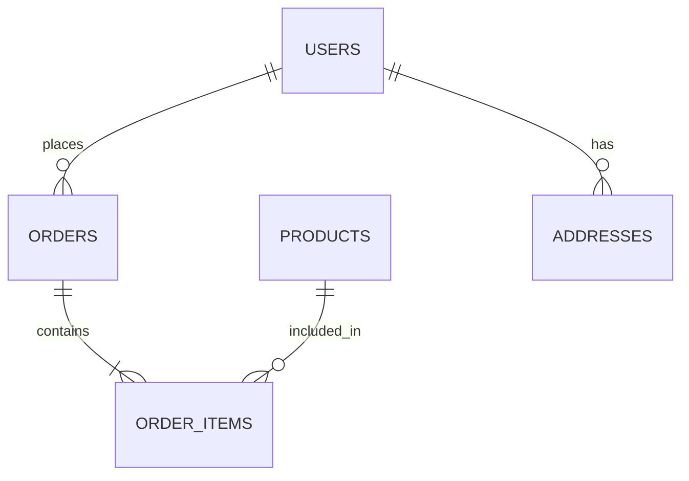

# データエンティティ関連図

| 項目 | 内容 |
|------|------|
| 作成日 | YYYY-MM-DD |
| 最終更新 | YYYY-MM-DD |
| ステータス | 草稿 / レビュー中 / 承認済み |

---

## 1. 概要

> システム全体（または対象機能群）のエンティティ間の関連を定義する。
> テーブル追加・リレーション変更時にこのドキュメントを更新する。

---

## 2. ER 図

> Mermaid 記法やテキストベースで表現する。

---

## 3. エンティティ一覧

| # | エンティティ名 | テーブル名 | 概要 | 備考 |
|---|--------------|----------|------|------|
| 1 |  |  |  |  |

---

## 4. リレーション一覧

| # | 親エンティティ | 子エンティティ | カーディナリティ | 外部キー | CASCADE | 備考 |
|---|-------------|-------------|---------------|---------|---------|------|
| 1 |  |  | 1:N / N:M / 1:1 |  | DELETE/UPDATE |  |

---

## 5. 多対多の中間テーブル

| 中間テーブル名 | エンティティ A | エンティティ B | 追加属性 |
|-------------|-------------|-------------|---------|
|  |  |  |  |

---

## 6. インデックス方針

| テーブル名 | インデックス対象 | 種別 | 理由 |
|----------|---------------|------|------|
|  |  | PRIMARY/UNIQUE/INDEX |  |

---

## 7. 未解決事項

| # | 内容 | 担当 | 期限 |
|---|------|------|------|
| 1 |  |  |  |
