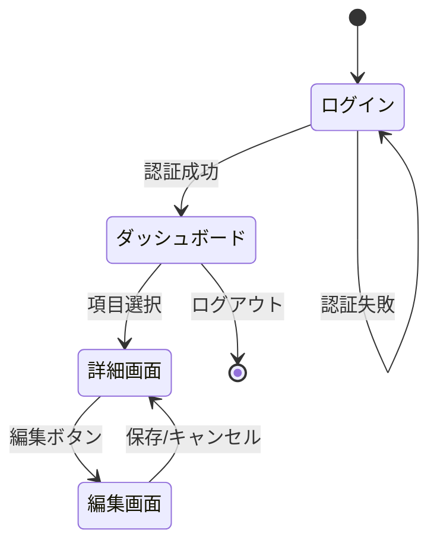

# 画面遷移図

| 項目 | 内容 |
|------|------|
| 作成日 | YYYY-MM-DD |
| 最終更新 | YYYY-MM-DD |
| ステータス | 草稿 / レビュー中 / 承認済み |

---

## 1. 概要

> アプリケーション全体（または対象機能群）の画面遷移を定義する。
> 新規画面の追加や既存フローの変更時にこのドキュメントを更新する。

---

## 2. 画面一覧

| # | 画面ID | 画面名 | URL パス | 認証 | 備考 |
|---|--------|--------|----------|------|------|
| 1 |  |  |  | 要/不要 |  |
| 2 |  |  |  | 要/不要 |  |

---

## 3. 画面遷移図

> Mermaid 記法やテキストベースの図で遷移を表現する。

---

## 4. 遷移条件

| # | 遷移元 | 遷移先 | トリガー | 条件 | パラメータ |
|---|--------|--------|---------|------|----------|
| 1 |  |  | ボタン押下/リンク/リダイレクト |  | クエリ/パスパラメータ |

---

## 5. 認証・認可ガード

| ガード種別 | 対象画面 | 未認証時の遷移先 | 備考 |
|-----------|---------|---------------|------|
| 認証必須 |  | /login |  |
| ロール制限 |  | /403 |  |

---

## 6. 未解決事項

| # | 内容 | 担当 | 期限 |
|---|------|------|------|
| 1 |  |  |  |
